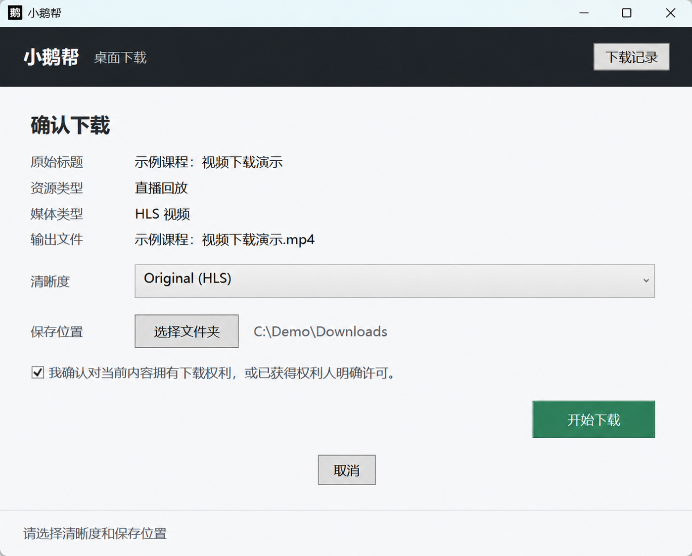
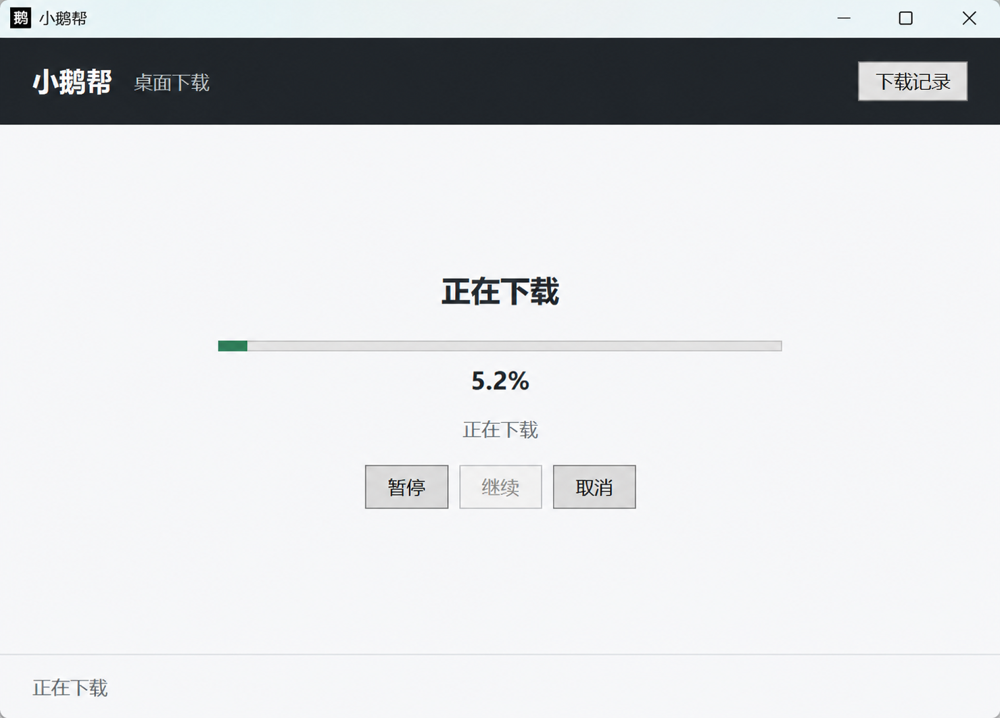
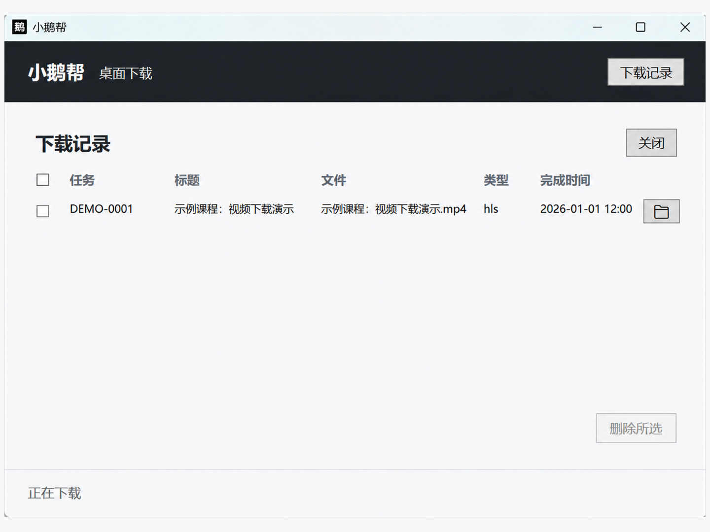

# 小鹅帮 - XiaoE Help

> 面向合法本地保存场景的 Windows 工具。通过 Edge / Chrome 扩展识别当前已打开的视频页面，并在电脑本机完成确认、下载、合并、校验和文件管理。

## 应用短介绍

小鹅帮通过浏览器扩展与 Windows 助手协作，帮助你把有权下载的兼容小鹅通视频保存为本地 MP4。任务和文件均在电脑本机处理，免费使用，无需注册小鹅帮账号。

## 应用介绍

小鹅帮是一套为 Windows 用户设计的本地视频保存工具，适用于内容所有者、获得明确授权的协作者，以及需要保存获准离线学习内容的用户。

使用时，只需打开自己有权访问和下载的具体视频页面，主动点击小鹅帮浏览器扩展。扩展会识别当前页面中的兼容媒体，并把单个任务交给 Windows 助手。开始前，你可以确认内容权利、选择可用画质和本地保存目录；随后由 Windows 助手完成下载、必要的媒体合并、文件校验和结果管理。

小鹅帮采用本地优先架构。视频、媒体地址、保存目录、任务进度和下载记录不会上传到小鹅帮官网，官网也不代理、转码或存储课程视频。软件免费使用，目前不提供付费套餐，也不需要小鹅帮账号。

## 核心功能

- **识别当前页面**：只在你主动点击扩展后检查当前标签页，不遍历课程列表。
- **兼容标准媒体**：处理已验证兼容的标准 MP4 与未加密 HLS，并将完成结果校验为本地 MP4。
- **下载前确认**：开始前确认下载权利、媒体信息、可用画质和保存目录。
- **本地任务控制**：显示任务进度，并在适用阶段提供暂停、继续、取消和有限重试。
- **可靠文件输出**：使用临时文件和完成校验，避免把不完整文件显示为成功结果。
- **本地下载记录**：保留最多 20 条、最长 30 天的成功记录，可逐项删除或清空；清除记录不会删除已保存的视频文件。
- **清晰错误提示**：针对登录、页面兼容性、媒体格式、助手连接、磁盘空间和目录权限等问题提供明确提示。
- **单任务设计**：同一时间处理 1 个本地任务，不提供批量下载、整店抓取或云端队列。

## 使用流程

1. 在 Edge 或 Chrome 中安装小鹅帮浏览器扩展。
2. 在 Windows 电脑上安装“小鹅帮 - XiaoE Help”助手。
3. 登录内容平台，打开自己有权下载的具体视频页面。
4. 点击浏览器工具栏中的小鹅帮扩展，识别当前页面。
5. 在 Windows 助手中确认权利、画质和保存目录后开始任务。
6. 等待下载、合并和校验完成，然后打开文件所在目录。

## 产品截图

### 下载前确认

在开始任务前核对内容、画质和本地保存位置。

### 本地下载进度

任务状态与处理进度在 Windows 助手中显示。

### 本地历史记录

查看已完成任务，并按需打开目录或清除本地记录。

## 本地优先与隐私

- 小鹅帮官网不接收、代理、转码或存储课程视频。
- 视频文件、媒体地址、保存目录、任务状态和下载历史由 Windows 助手在本机处理。
- 浏览器扩展仅申请 `activeTab`、`scripting` 和 `nativeMessaging` 权限，不申请 `cookies` 权限，也不读取或保存 Cookie 值。
- 扩展只在用户主动打开后处理当前标签页，不会后台遍历课程或批量创建任务。
- 本地应用会校验消息结构、媒体来源、网络地址、重定向、文件名、保存路径和随包工具完整性。
- 诊断信息采用固定错误码和脱敏处理，避免暴露账号凭证、完整媒体地址或本地路径。

## 兼容环境

| 项目       | 首发范围                                          |
| ---------- | ------------------------------------------------- |
| 操作系统   | Windows 11 x64                                    |
| 浏览器     | 当前版本的 Microsoft Edge 或 Google Chrome（x64） |
| 浏览器组件 | 小鹅帮浏览器扩展，需与 Windows 助手配套安装       |
| 目标媒体   | 经验证兼容的标准 MP4、未加密标准 HLS              |
| 输出文件   | 本地 MP4                                          |
| 界面语言   | 简体中文                                          |
| 安装方式   | 当前 Windows 用户安装，无需管理员权限             |
| .NET 环境  | 安装包自带所需运行时，无需另行安装 .NET           |

实际兼容性会受到页面结构、媒体格式、访问权限、网络环境和第三方平台变化影响，请以对应版本的兼容性说明和发布记录为准。

## 使用边界

小鹅帮仅用于用户拥有下载权或已获得权利人明确许可的内容。能够登录、购买、订阅或播放内容，并不自动代表拥有下载、复制、传播或商业使用权。

以下场景不受支持：

- DRM、访问控制、付费墙或专有混淆等受保护内容；
- 需要导出 Cookie、Token、账号密码或其他凭证的处理方式；
- 课程列表遍历、批量下载、整店抓取或无人值守任务队列；
- 来源校验失败、媒体地址过期、非公开网络地址或异常重定向；
- 未经授权的下载、复制、传播或其他侵犯第三方权益的用途。

遇到受保护、不兼容或来源异常的内容时，小鹅帮会停止任务，不提供绕过路径，也不会生成看似成功的不完整文件。请优先使用内容平台或内容提供方提供的官方离线功能。

## 费用说明

小鹅帮免费使用，目前不提供付费套餐、订阅、广告、捐赠或应用内购买。网络流量、磁盘空间、设备电量，以及内容平台可能收取的课程或服务费用，均由相应服务商或用户设备产生，不由小鹅帮收取。

## 独立工具声明

小鹅帮是独立开发的兼容工具，与小鹅通不存在隶属、授权、赞助或合作关系。小鹅通及相关商标、平台和内容归其相应权利人所有。

## 发布信息

| 项目                  | 内容                                     |
| --------------------- | ---------------------------------------- |
| 应用名称              | 小鹅帮 - XiaoE Help                      |
| 应用类别              | 实用工具                                 |
| 当前 Windows 助手版本 | 0.1.0                                    |
| 配套浏览器扩展版本    | 0.1.0.5                                  |
| 系统架构              | x64                                      |
| 价格                  | 免费使用                                 |
| 官网                  | <https://xiaoe.help>                     |
| 隐私政策              | <https://xiaoe.help/privacy>             |
| 使用条款              | <https://xiaoe.help/terms>               |
| 版权说明              | <https://xiaoe.help/copyright>           |
| 开源软件声明          | <https://xiaoe.help/open-source-notices> |

> 发布前请使用最终安装包复核版本号、代码签名、安装包大小、SHA-256、发布日期和兼容性证据，并确保应用介绍与对应发布记录一致。
